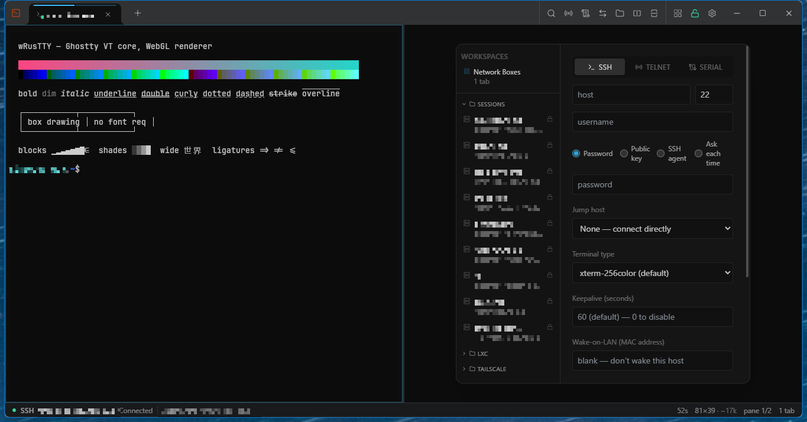
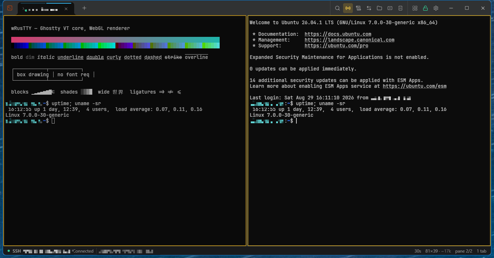
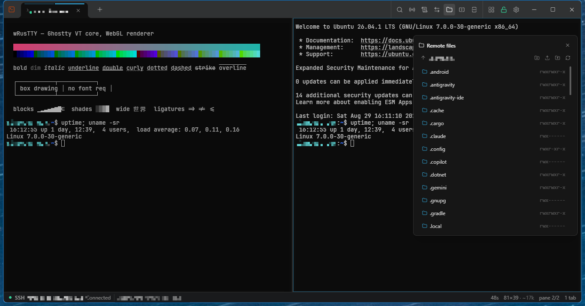
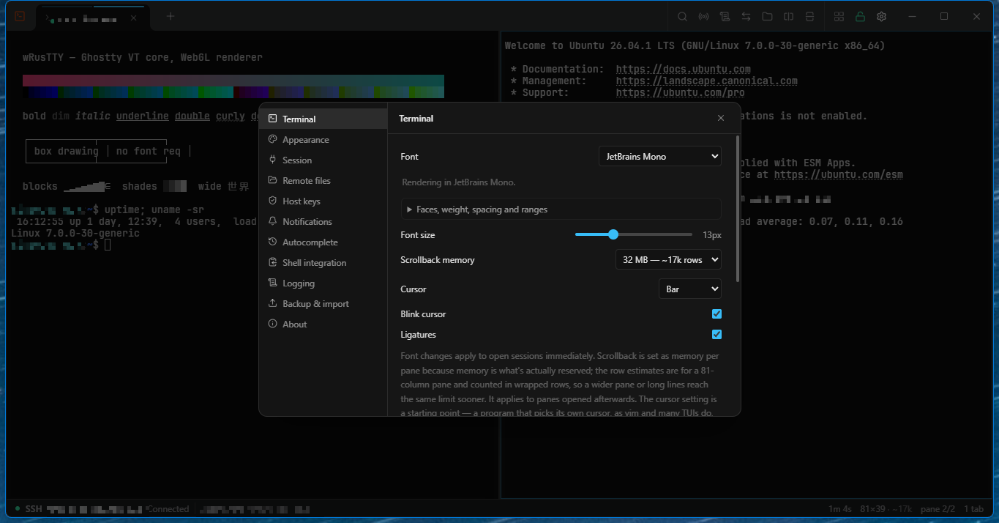
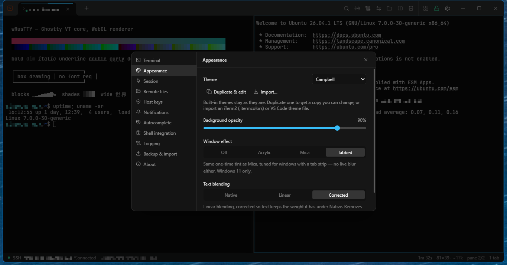
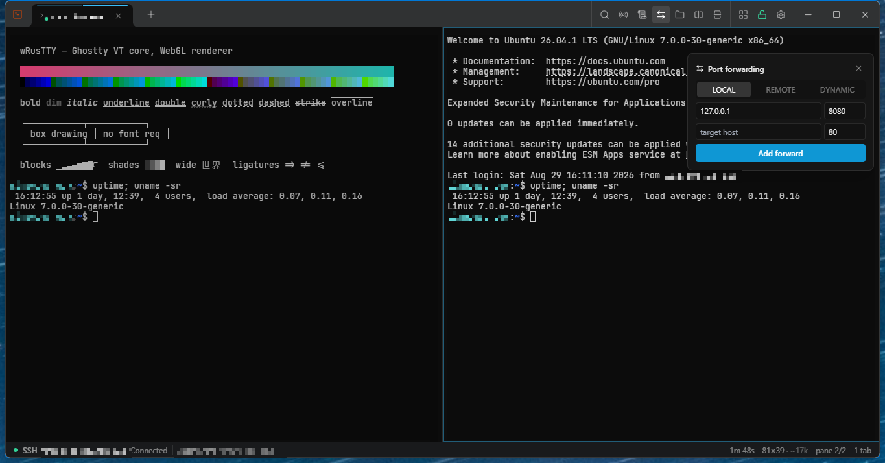

# wRusTTY

A fast, native terminal client for Windows — SSH, Telnet, Serial and local
shells in one tabbed window, with an encrypted credential vault, split panes,
SFTP file browsing and a GPU-accelerated terminal built on
[Ghostty](https://github.com/ghostty-org/ghostty)'s VT core.

Rust + [Tauri 2](https://v2.tauri.app/) under a React front end. The installer
is under 10 MB and it runs on the WebView2 that ships with Windows — there is no
bundled Chromium, no Node runtime, and no ~200 MB of `app.asar` behind it.



## Why this exists

It started as a PuTTY + SuperPuTTY replacement, and it still does that job —
it reads PuTTY `.ppk` keys, imports your PuTTY registry sessions, talks to
Pageant, and does serial line control properly. But it has outgrown the brief.
What it is now is a general-purpose terminal client for people who live on
remote hosts: network gear over serial, a rack of switches over telnet, Linux
boxes over SSH, all in the same window, with a real modern terminal underneath
instead of a 1999 one.

The terminal is not a reimplementation. Ghostty's VT core is compiled to WASM
and drives an in-house WebGL renderer, so parsing, keyboard encoding (including
the Kitty protocol), mouse reporting and paste handling are all Ghostty's —
which is why things like `CSI > flags u`, SGR-pixel mouse coordinates and
curly underlines just work.

## Features

**Protocols**
- **SSH** — password, public key, SSH agent, and keyboard-interactive
  ("ask each time") for 2FA, Duo pushes and PAM prompts, with the server's own
  prompts relayed verbatim
- **Telnet** — full option negotiation (ECHO, SGA, NAWS, TTYPE)
- **Serial** — COM enumeration with hotplug, baud/parity/stop/flow, DTR/RTS
  toggles, break signalling for Cisco password recovery and ROMMON, local echo
  and CR/LF/CRLF line-ending control, plus Normal / Local echo / Readline /
  Readline-hex input modes
- **Local shells** — PowerShell 7, Windows PowerShell, CMD, Git Bash and every
  installed WSL distro, detected and offered from a list, on a Windows
  pseudoconsole. Saveable like any other session
- **Administrator tabs** — a PowerShell, CMD or Git Bash tab running elevated
  inside an ordinary, unelevated window, through one UAC prompt per tab. Marked
  with a shield and `ADMIN`, never reopened without asking, and no command
  history is kept

**Keys and auth**
- OpenSSH and PuTTY `.ppk` private keys (v2 and v3, encrypted or not) read
  natively — no conversion step
- Windows OpenSSH agent and Pageant, tried in that order; FIDO2 security keys
  and PIV smartcards work because the agent holds the key
- known_hosts TOFU with an accept/reject prompt, and a Host keys screen to
  review and remove what you have trusted

**Connectivity**
- **ProxyJump / jump host chains**, with each hop prompting separately
- **Port forwarding** — local, remote and dynamic (SOCKS), with a management
  panel; forwards are owned by the backend, so they survive the panel closing
  and are re-established after a reconnect
- **Keepalive and auto-reconnect** — the session comes back, and so do its port
  forwards and its in-flight file transfers
- **Wake-on-LAN** — a per-session MAC, probed first so an awake host is never
  sent a packet, with a *Wake* action on any saved session
- **Outbound proxy** — reach SSH hosts (or their jump host) through an HTTP
  CONNECT or SOCKS5 proxy, set once in Settings; the proxy resolves the name,
  and any saved session can opt out

**Terminal**
- Ghostty VT core + WebGL renderer: 24-bit colour, wide characters and grapheme
  clusters, all five underline styles, overline, DECSCUSR cursor shapes
- Kitty keyboard protocol, `modifyOtherKeys` and legacy xterm encoding, chosen
  from the modes the far end sets
- All five mouse tracking modes and all five wire formats, including SGR-pixels
- Box drawing, block elements and Powerline glyphs drawn as geometry, so borders
  in `htop`, `nmtui` and vendor menu UIs tile without hairline gaps — and work
  on a machine where you cannot install a font
- Font *stack*, not a family string: a family per style, OpenType features,
  variable axes and a codepoint range table, with families enumerated through
  DirectWrite. **JetBrains Mono, Fira Code and Monaspace Neon ship in the
  installer**, so a locked-down box needs no font install
- Ligatures (off by default), and glyph blending in linear light
- Scrollback search, configurable scrollback budget, copy-on-select, right-click
  paste, bracketed paste with a confirmation the *core* decides on
- URL detection with Ctrl+click, plus a keyboard hint mode for when a program
  has the mouse
- Remote programs can set the clipboard over OSC 52 (switchable in Settings)
- Session logging to file — per session, remembered by a saved session, or for
  every session automatically — into a folder you choose

**Window and workflow**
- Tabs and **split panes**, with **broadcast input** — type once, send to every
  pane in the tab, with every pane ringed in amber while it is on
- **Workspaces** — save which sessions are open and how the panes are split, and
  reopen the arrangement later
- **Restore on launch** (optional) — the tabs and splits that were open come
  back on restart. A session whose password was typed rather than stored comes
  back as a blank pane, and an administrator tab comes back as a card asking
  whether to reopen it
- Saved sessions in folders you create, shared across all three protocols, with
  the transport as a per-item icon
- A saved serial session records the adapter's **USB identity** (vendor, product
  and serial number), not its COM number, so it survives a replug, a reboot and
  a different socket
- Quick-connect palette, duplicate/reconnect/restart from the tab menu
- **Configurable keyboard shortcuts** in Settings → Keyboard, with conflicts
  flagged and a guard against binding a key that is ordinary typing
- Mica/acrylic window material, per-pane background opacity, eleven built-in
  themes, a custom theme editor, and an importer for iTerm2 `.itermcolors` and
  VS Code colour themes; an unfocused window can fade or turn see-through
- Shell integration (OSC 133/633) for per-command status and a notification when
  a long command finishes in the background — snippets for bash, zsh, fish and
  PowerShell
- Recent-command autocomplete, per host, ranked in Rust and off by default

**Files (SFTP)**
- Browse, edit and transfer in both directions, streamed, with progress,
  cancellation and resume
- Drag a file onto a pane to upload it into that pane's current directory
- Rename, delete, new folder and chmod from the context menu
- Editing a root-owned file over a held sudo helper channel
- A transfer survives the connection dropping — it is set aside and resumed onto
  the channel the reconnect brings back

**Credential vault**
- One random data key encrypts every stored secret (XChaCha20-Poly1305), with
  one wrapper per unlock method holding its own encrypted copy of that key
- **Master password** (Argon2id), always present and deliberately not removable
- **Windows Hello** (optional) — the wrapping key is derived by signing a stored
  challenge with a TPM-held credential gated on a Hello gesture, so nothing
  recoverable sits at rest
- **Windows sign-in** as a fallback where Hello is unavailable (DPAPI via
  Credential Manager)
- Secrets are decrypted only in the Rust process and never sent to the webview
- Encrypted `.wrb` export/import
- An unlock lasts until the Windows session locks, the app exits, or you lock it
  from the padlock menu

**Migrating in** — two one-time imports in Settings → Import, both additive and
safe to run twice:
- **From PuTTY**: `HKCU\Software\SimonTatham\PuTTY\Sessions`, read-only, PuTTY's
  own keys untouched. SSH, telnet and serial come across; `raw` and `rlogin` are
  skipped rather than imported as something they aren't
- **From `~/.ssh/config`**: every literal `Host` block, with `HostName`, `Port`,
  `User`, `IdentityFile`, `ProxyJump` and `ServerAliveInterval`; `Include` is
  followed, and a `ProxyJump` is linked to the session it names

## Screenshots

| | |
|---|---|
|  **Split panes with broadcast input** — one command, every pane, each ringed in amber while the mode is on. |  **Remote files over SFTP** — browse, edit, upload and download, with permissions shown. |
|  **Terminal settings** — bundled fonts, a font stack, scrollback as a memory budget, cursor and ligatures. |  **Appearance** — themes with a duplicate-and-edit editor, iTerm2/VS Code import, opacity, Mica and linear text blending. |



*Port forwarding — local, remote and dynamic, managed per session.*

## Install

Download the latest installer — `.exe` (NSIS) or `.msi`, both x64 — from
[**Releases**](https://github.com/pletch/wrustty/releases).

**The installers are not code signed, so expect a SmartScreen warning** the
first time you run one. Click *More info* → *Run anyway*.

Windows is the target. The Linux and macOS Tauri paths are not maintained, and
several features (DirectWrite font enumeration, Windows Hello, PuTTY registry
import, Mica) are Windows-only by nature.

## Building

Prerequisites: Node.js 22+ (24 is what it is developed on), Rust stable, and
WebView2 — see the [Tauri prerequisites guide](https://v2.tauri.app/start/prerequisites/).

```sh
npm install
npm run tauri:dev     # run the desktop app, with devtools
npm run tauri dev     # same, without devtools
npm run tauri build   # NSIS + MSI installers
```

Devtools are a cargo feature rather than always-on, so release installers ship a
webview that cannot be inspected — the process holds decrypted vault secrets and
renders untrusted remote output. `tauri build` never enables it.

The benchmark harness and the measurement instruments are gated by Vite mode, so
a release build contains neither — their `import.meta.env` branches are dead and
no chunk is emitted. `npm run build:instrumented` gives you an optimised build
that still carries them.

You do **not** need Zig or WSL to build or change anything here; the Ghostty core
is committed at `src/lib/ghostty/vendor/ghostty-vt.wasm`. Rebuilding it is only
needed to move to a different Ghostty commit — see
[`docs/PORT_GHOSTTY_MAIN.md`](docs/PORT_GHOSTTY_MAIN.md).

### Checks

```sh
npm run lint && npm run build   # frontend
npx vitest run                  # frontend tests
cargo fmt --all --check
cargo clippy --workspace --all-targets -- -D warnings
cargo test --workspace
```

### Layout

- `src/` — React + TypeScript front end
- `src-tauri/` — Tauri app shell (commands, window/state wiring)
- `crates/wr-core` — session model, protocol-agnostic `Connector`/`Session` traits
- `crates/wr-ssh` — SSH transport (auth, kex, host keys, PTY, forwarding)
- `crates/wr-telnet` — Telnet transport
- `crates/wr-serial` — serial transport
- `crates/wr-local` — local shells on a pseudoconsole, and the elevated host
- `crates/wr-vault` — encrypted credential vault
- `crates/wr-sftp` — SFTP
- `crates/wr-fs` — atomic file replacement, shared by every on-disk store

Every transport implements the same `Connector`/`Session` pair, so the tab
manager and front end are protocol-agnostic.

## Notes worth knowing

- **Terminal type** is per session. SSH defaults to `xterm-256color`; telnet
  defaults to `vt100`, since its remaining users are largely network gear.
- **Backspace** is per session: `^?` (DEL) by default, `^H` for network gear and
  older Unix. Wrong one = backspace does nothing or echoes `^?`.
- **24-bit colour** is requested with `COLORTERM=truecolor`, which sshd only
  forwards if it is in `AcceptEnv`. If colours look limited, add it there or set
  the session's terminal type to `xterm-direct`.
- **Emoji render in colour** where the font has colour glyphs (Segoe UI Emoji
  does), from a second texture kept apart from the text atlas.
- **Agent auth and `MaxAuthTries`**: an agent loaded with many keys can be cut
  off (OpenSSH defaults to 6 attempts) before the right one is reached.
- **Wake-on-LAN doesn't route.** The default 255.255.255.255 reaches this
  machine's segment only; a host on another subnet needs its directed broadcast
  (e.g. `192.168.1.255`) in *Broadcast to*. On the target, Wake-on-LAN needs the
  adapter's *Wake on Magic Packet* and power-management options enabled, and
  Fast Startup off to wake from a full shutdown. Wi-Fi wake is unreliable;
  Ethernet is what this works on consistently.
- **A host that sleeps mid-session**: Windows' idle timer ignores network
  traffic, so keepalives don't help. [`tools/keep-awake.ps1`](tools/keep-awake.ps1)
  runs on the remote host and holds it awake.

## Further reading

- [`docs/PROJECT_PLAN.md`](docs/PROJECT_PLAN.md) — architecture, the full feature
  inventory with per-item status, and the phased build plan
- [`docs/SHELL_INTEGRATION.md`](docs/SHELL_INTEGRATION.md) — OSC 133/633 setup
- [`docs/AUTOCOMPLETE_PLAN.md`](docs/AUTOCOMPLETE_PLAN.md),
  [`docs/AUTO_RECONNECT_PLAN.md`](docs/AUTO_RECONNECT_PLAN.md),
  [`docs/URL_LINKS_PLAN.md`](docs/URL_LINKS_PLAN.md),
  [`docs/LOCAL_SHELL_PLAN.md`](docs/LOCAL_SHELL_PLAN.md),
  [`docs/ELEVATED_TABS_PLAN.md`](docs/ELEVATED_TABS_PLAN.md),
  [`docs/NATIVE_SEARCH_PLAN.md`](docs/NATIVE_SEARCH_PLAN.md)
- [`docs/PORT_GHOSTTY_MAIN.md`](docs/PORT_GHOSTTY_MAIN.md) — the Ghostty pin and
  the port's record

## License

MIT — see [LICENSE](LICENSE).

The three bundled font families are SIL OFL 1.1, and each license travels with
its font in `src/assets/fonts/<family>/OFL.txt`. Monaspace carries a Reserved
Font Name, so it ships byte-for-byte as published and must not be subset.
